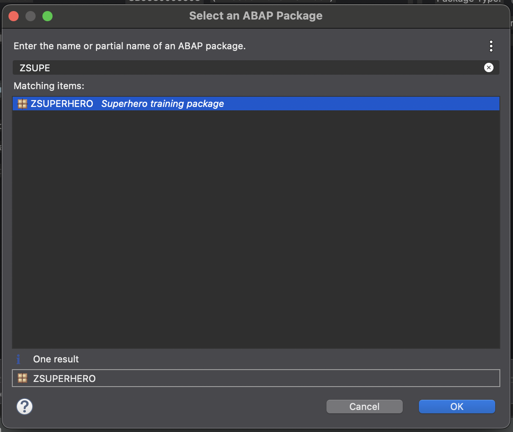

# setup of development
1. create package
  - *Favorite Packages --> New --> ABAP Package
  

  - Name: ZSUPERHERO
  - Description: Superhero training package
  - **next**
  
  
  - Software Component: ZLOCAL
  - **next**
  

  - create new request 
  - description: Super hero RAP training
  - *Finish*
  

  - *Favorite packages* --> add package
  

  - search: ZSUPERHERO
  - select 
  - **OK**
  
