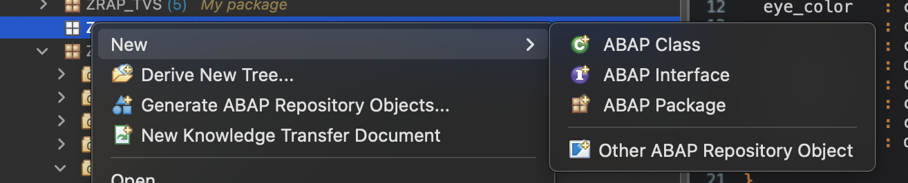
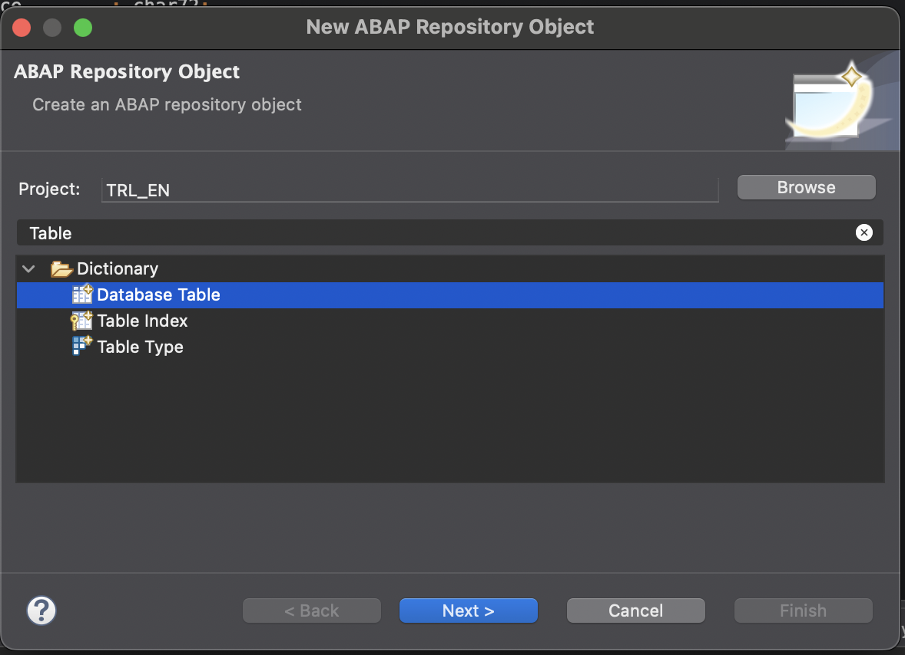
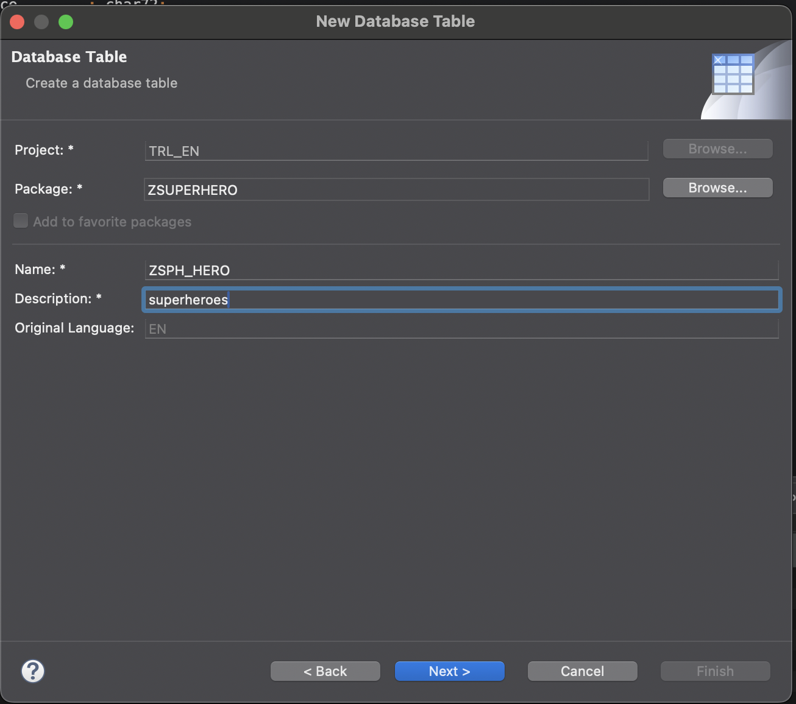
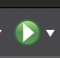
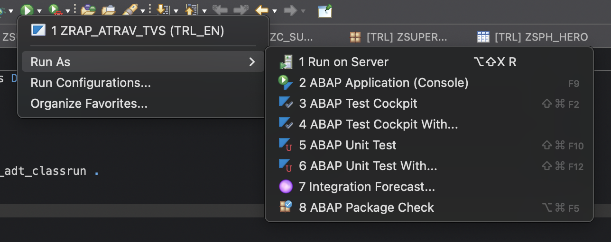

# Create new database tables

## Intro
    In this part we will create the follwing 3 database tables to contain the data that we will use further in the exercises.

- Superheroes
- Battles
- Universes

**It is important that the names of the tables, fields and types are correct for the data loader class to work**   

## Creating a table 
- *ZSUPERHERO (package)*->new->Other ABAP repository object


- *Select* Dictionary->Database Table
- **Next**


- Fill required fields
- **Next**
!

- select transport 
- **finish**


## Tables 

Create the tables with the fields as described below after creating a table activate it using the activate button on top 

### ZSPH_HERO
```
key client  : abap.clnt not null;
key hero_id : int2 not null;
name        : char72;
gender      : char7;
eye_color   : char13;
race        : char72;
hair_color  : char72;
height      : d16n;
publisher   : char72;
skin_color  : char13;
alignment   : char9;
weight      : d16n;
```

### ZSPH_BATTLE
```
key client        : abap.clnt not null;
key battle_id     : int2 not null;
hero_id           : int2 not null;
hero_universe_id  : int2 not null;
enemy_id          : int2 not null;
enemy_universe_id : int2 not null;
url               : char256 not null;
win_percent       : d16n not null;
lose_percent      : d16n not null;
draw_percent      : d16n not null;
```

### ZSPH_UNIVERSE
```
key client      : abap.clnt not null;
key universe_id : int2 not null;
name            : char72;
```

## Create a data loader class 

- Similar to creating a table create a new class in you package with name ZCL_FILL_HEROES
- Copy the source code of the file code/data-loader.class
- Save and activate this class 
    - This may take a while because of the size of this class 
    - It helps to grab a coffee close eclipse and re-open it
- Run the class by pressing the run button 
- Choose Run as -> ABAP Application (console) 
- When the run is complete the console will state *demo data inserted.*
- Validate the tables contain data 
    - Right click the table in the project explorer
    - Choose open with -> data preview


