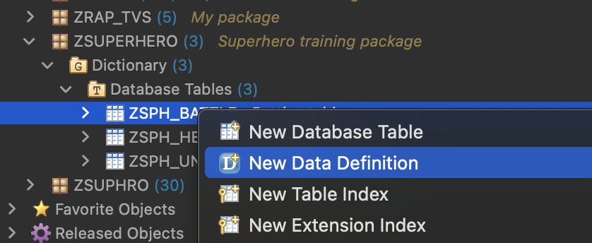
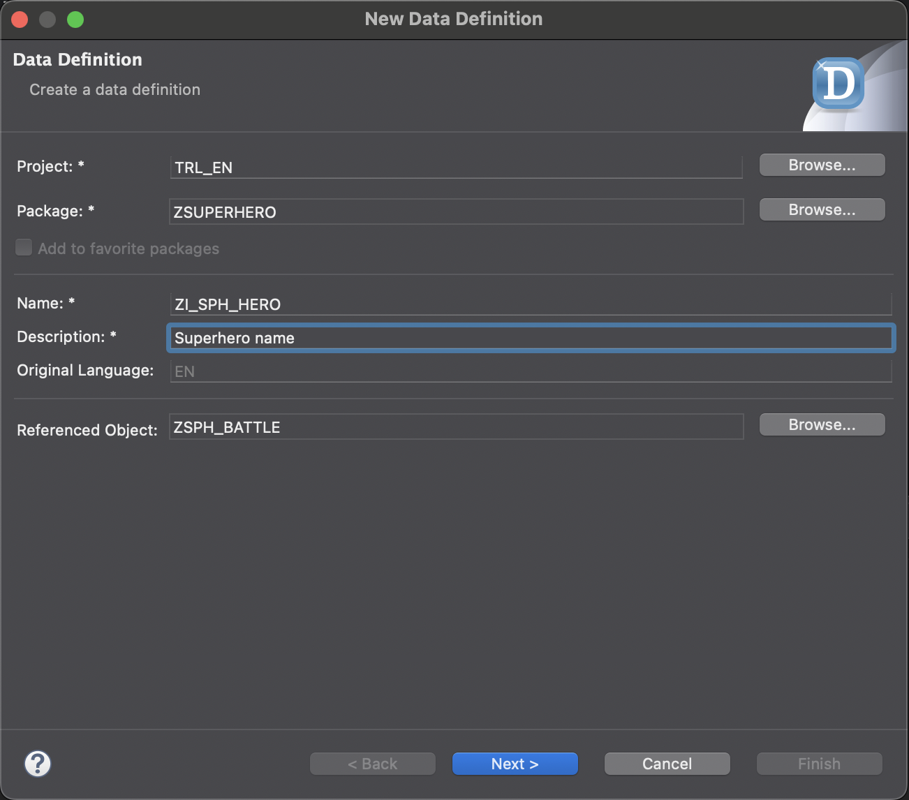
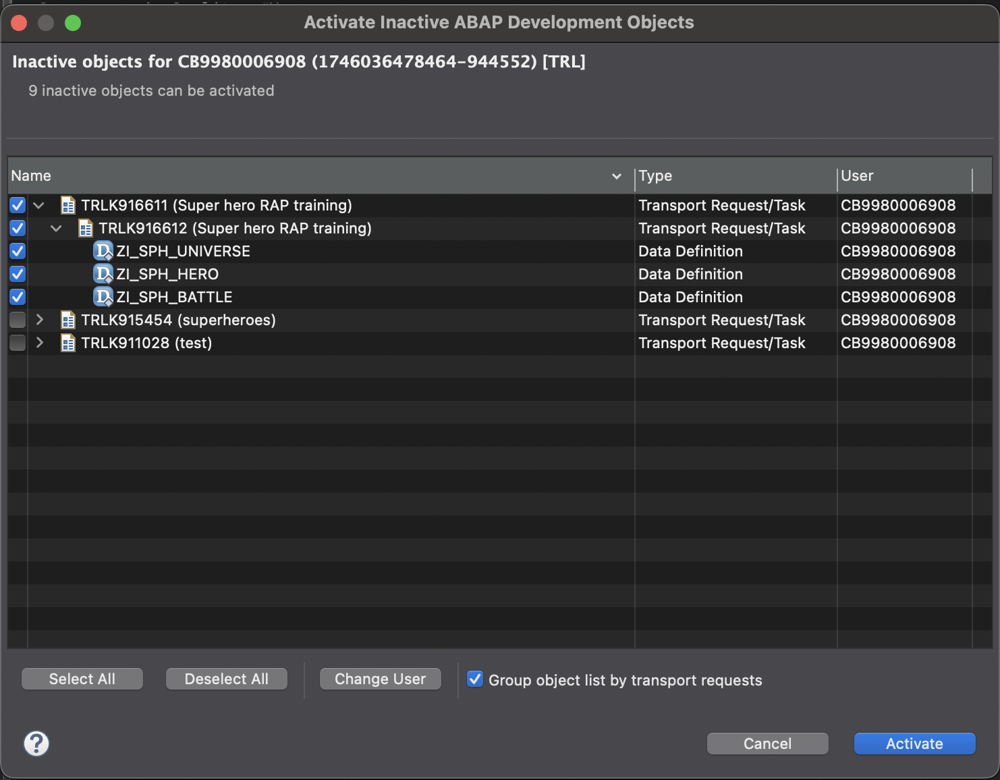

# Create interface views 
In this part we will create interface views. Interface views are are a way to structure, simplify and expose the data from the tables. 
We will create 2 types of entities 
- Two root entity (hero universe)
- Two entities (battle)

## creating entities
The easiest way of creating the entities based on a table is the folllowing
- right click the table you want to create the entity for
- choose *new data definition*



- in the popup you should see that the referenced object is already filled
- fill the name 
    - Start with ZI_ (custom object and interface view)
    - SPH_ (prefix for all objects in our project)
    - {entity name}
- **Next**


- choose you transport 
- **Next** (do not choose finish this will save time)
- On the next screen you can select your template
    - Define Root View Entity for Hero
    - Define View Entity for the others 
- **Finish**


## linking entities 
You can now link the entities by using associations.
```
    Associations will be converted to join statements at runtime, but only when the fields from the associations is requested.
```
### On the battle entity 
    - Link to the parent hero
    ```
        ...
        define root view entity ZI_SPH_BATTLE as select from zsph_battle
        association to parent ZI_SPH_HERO as _hero on $projection.HeroId = _hero.HeroId
        ...
    ```
    - Link the Enemy
    ```
        ...
        association [1] to ZI_SPH_HERO as _enemy on $projection.EnemyId = _enemy.HeroId
        ...
    ```
    - Link the hero and enemy universe
    ```
        ...
        association [1] to ZI_SPH_UNIVERSE as _heroUniverse on $projection.HeroUniverseId = _heroUniverse.UniverseId
        association [1] to ZI_SPH_UNIVERSE as _enemyUniverse on $projection.EnemyUniverseId = _enemyUniverse.UniverseId
        ...
    ```
    - Add the associations to the entity, as the last properties
    ```
        ...
            draw_percent as DrawPercent, 
            _hero, 
            _enemy, 
            _heroUniverse, 
            _enemyUniverse
        }
    ```
### On the hero entity
    - link to the battle children
    ```
        ...
        define root view entity ZI_SPH_HERO as select from ZSPH_HERO
        composition [0..*] of ZI_SPH_BATTLE as _battles
        ...
    ```

### activate all the entities
- Since there are 2 way links between the entities it might not be possible to activate them separatly
- use the multi activate button to activate all objects 
- Select all objects in your transport 
- **Activate**

