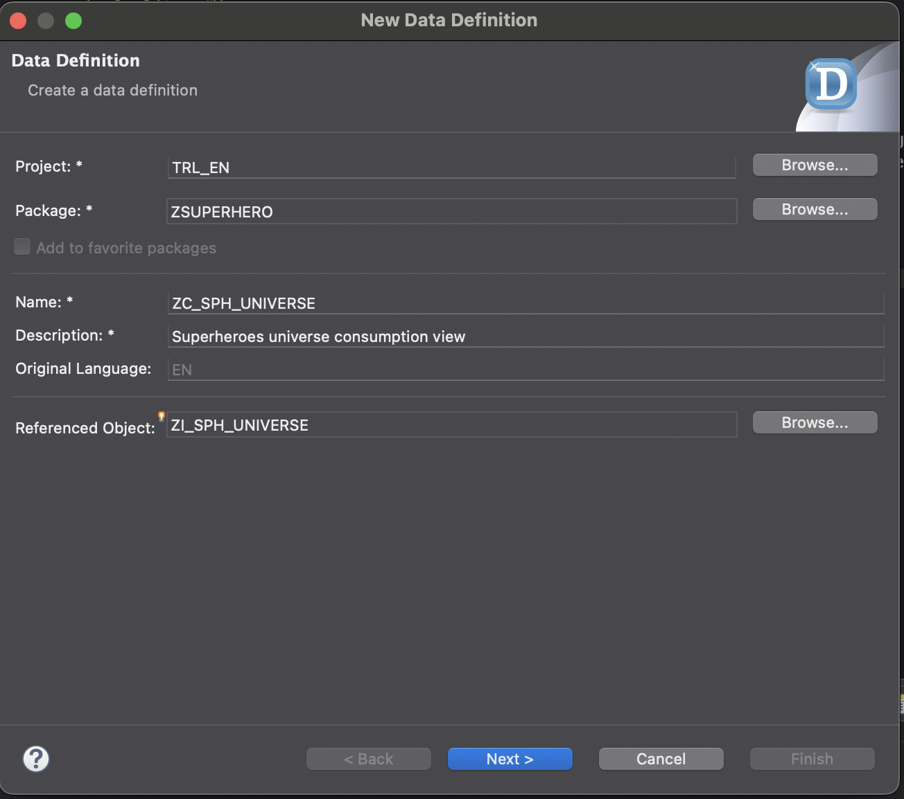
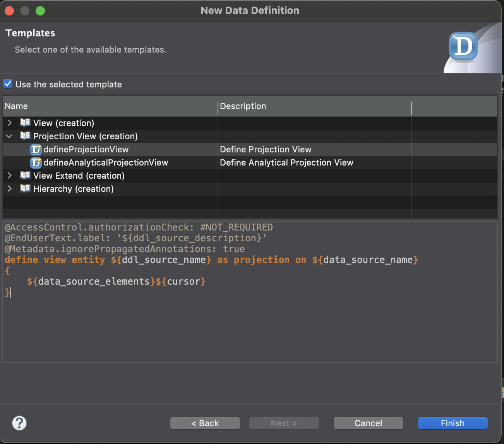

# Create consumption views 
In this part you will create consumption views. Consumption views are used to present and cosume business object by services. 

## creating the views
- for each of the interface views that you made in the previous part now make a consumption view. The easiest way to do so is:
    - Right click on the interfece view in your project explorer
    - Choose new data definition
    - The inteface view should be filled as a referenced object 
    - The name of the consumption view should be the same as the interface view but with ZI_ replaced by ZC_
    - **Next**
    
    - Choose you transport 
    - **Next**
    
    - select Define projection view
    - **Finish**
    
    - for the root entity you have to change view to root view
    - for the root entity you have to add the provider contract
    ```
        define root view entity ZC_SPH_UNIVERSE
        provider contract transactional_query
    ```


## redirect your associations
The associations in the projection still reference the interface views they are based on, to mitigate this we have to redirect them in the consumption views by adding the *redirected* statement

### ZC_SPH_BATTLE
```
      ...
      /* Associations */
      _enemy         : redirected to ZC_SPH_HERO,
      _enemyUniverse : redirected to ZC_SPH_UNIVERSE,
      _hero          : redirected to to parent ZC_SPH_HERO,
      _heroUniverse  : redirected to ZC_SPH_UNIVERSE
}
```

### ZC_SPH_HERO
```
    ...
    /* Associations */
    _battles : redirected to composition child ZC_SPH_BATTLE
}
```

