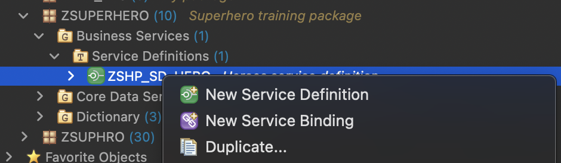
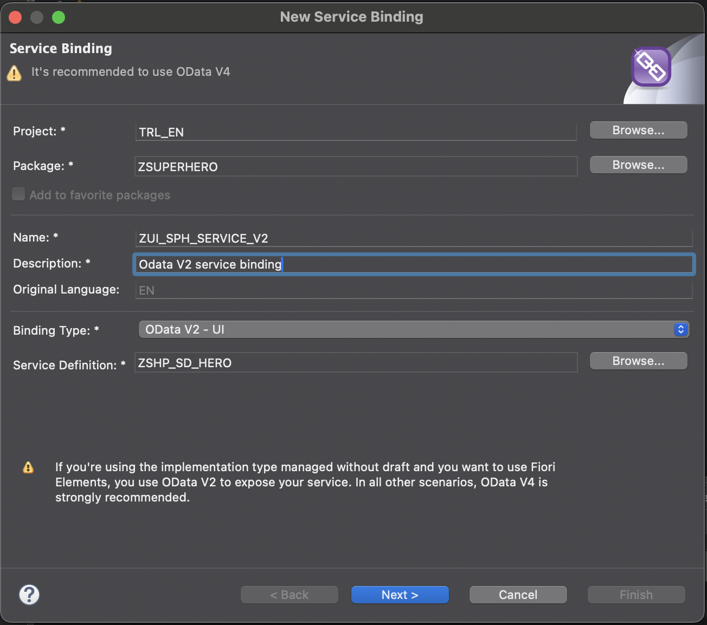
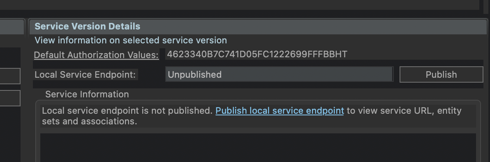

# Create new service binding 
- Right click your service definition 
- Choose *new service binding*

- choose a name 
- Choose a description 
- Binding type *OData V2 - UI*
- **Next**

- choose transport 
- **Finish**

- activate your service binding 
- Publish the service binding


## preview service 
After publishing the service binding you will be able to see a preview of your service via the preview function. Fiori elements pages will be used for the preview 
- select hero entity
- press preview 

```
If publishing takes a long time you can try to close and re-open eclipse. Due to timeouts sometimes the publishing seems to be running endlessly
```

