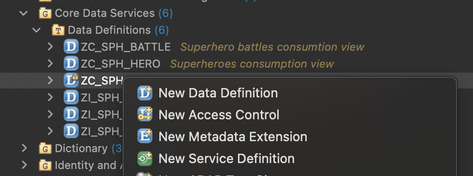
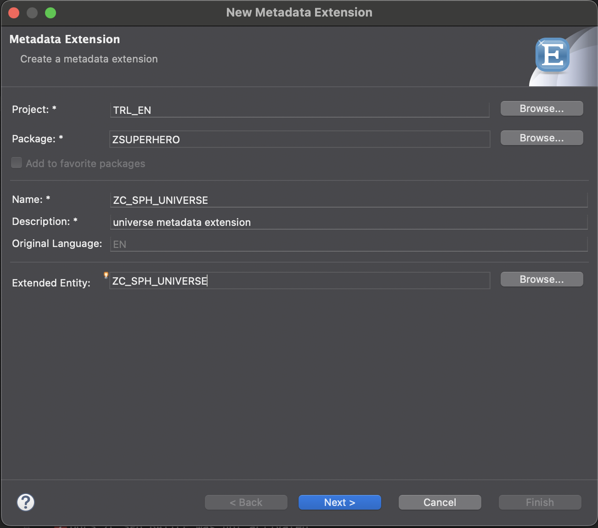
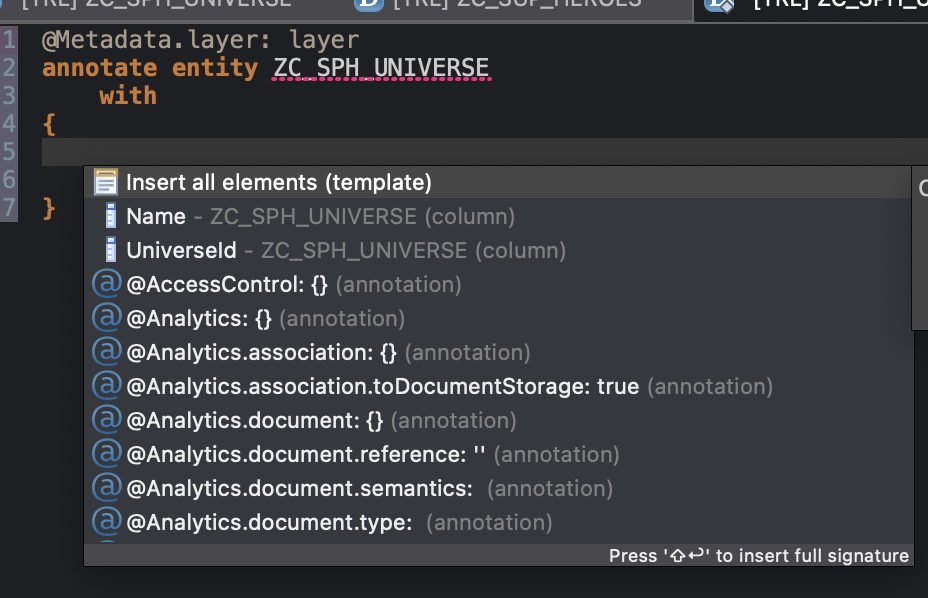

# Add Metadata files 
We will now annotaions to the different entities with these annotations you define how the data is displayed on Fiori elements apps

## created metadata extensions
- on each consumption view add allow metadata tag in the header 
```
    ...
    @Metadata.ignorePropagatedAnnotations: true
    @Metadata.allowExtensions: true
    ...
```
- for each consumption view create the file by:
    - Right click the consumption view in the project repository
    - choose *New Metadata Extension*
    
    - copy the name of the composition view
    - choose a description 
    - **Next**
    
    - choose transport 
    - **Next**
    
    - Annotate entity
    - **Finish**

## add elements to the metadata extension
```
In this trainint we did not use dedicated data elements on our tables. When they are used they will determine the default labels of fields on the screen
```
- for each metadata extension 
    - set the metadata layer to #CORE
    - remove the dummy element
    - press crtl + space
    - choose insert all elements
    - remove the associated elements
    
    - Add the follwing annotations for each element
        - line item
            - position - position of the element in a table view (done in steps of 10 to have the option to insert elements)
            - label - label for the item in a table view 
        - identification 
            - position - position of the element on the detail page 
            - label - label of the element on the detail page
    ```
        @Metadata.layer: #CORE
        annotate entity ZC_SPH_HERO with
        {
        @UI: {  lineItem:       [ { position: 10, label: 'Hero ID'} ],
        identification: [ { position: 10, label: 'Hero ID'}  ] }
        HeroId;

        @UI: {  lineItem:       [ { position: 20, label: 'Hero name'} ],
        identification: [ { position: 20, label: 'Hero name'}  ] }
        Name;

        @UI: {  lineItem:       [ { position: 30, label: 'Gender'} ],
        identification: [ { position: 30, label: 'Gender'}  ] }
        Gender;
    ```
    - go back to your preview and check the result

    ## add header and facet data
    - for the hero entity metadata add UI header info 
    - this info will determine the way the object is diplayed
        - header info
            - type name (plural) how one or multile entities are called
            - title: element that is the title of the object page 
            - description: element that is the subtitle of the object page 
        - presentatoin variant
            - in this case we determine the default sort order
    ```
    @UI: {
    headerInfo: { typeName: 'Superhero',
                    typeNamePlural: 'Superheroes',
                    title: { type: #STANDARD, value: 'Name' },
                    description: { type: #STANDARD, value: 'HeroId' }  },
                    
    presentationVariant: [{ sortOrder: [{ by: 'HeroId', direction:  #DESC }] }] }
    ```

    - the facet data is added as an annotation on the first element 
    - this will define the tabs that are shown on the object page
    - in this case we add 2 facets
        - the identification data of the hero object 
        - a list of battle info for the hero

    ```
    annotate entity ZC_SPH_HERO with
    {
    @UI.facet: [ { id:              'Hero',
                    purpose:         #STANDARD,
                    type:            #IDENTIFICATION_REFERENCE,
                    label:           'Hero',
                    position:        10 },
                { id:              'Battle',
                    purpose:         #STANDARD,
                    type:            #LINEITEM_REFERENCE,
                    label:           'Battle', 
                    position:        20,
                    targetElement:   '_battles'} ] 
    @UI: {  lineItem:       [ { position: 10, label: 'Hero ID'} ],
    identification: [ { position: 10, label: 'Hero ID'}  ] }
    HeroId;
    ```

    ## Make the battle list nicer 
    - on the header facet for the battles add a target qualifier (this will allow us to make a different list view on the battles table)
    ```
    annotate entity ZC_SPH_HERO with
    {
    @UI.facet: [ { id:              'Hero',
                    purpose:         #STANDARD,
                    type:            #IDENTIFICATION_REFERENCE,
                    label:           'Hero',
                    position:        10 },
                { id:              'Battle',
                    purpose:         #STANDARD,
                    type:            #LINEITEM_REFERENCE,
                    label:           'Battle',
                    targetQualifier: 'niceList',
                    position:        20,
                    targetElement:   '_battles'} ] 
    ```
    - on the batlles metadata we will add some annotations all with the same qualifier we defined on the hero entity
        - Make the battle ID a link to the battle url 
        ```
        @UI: {  lineItem:       [ 
            { position: 10, label: 'Battle ID'}, 
            { position: 1, label: 'Battle ID', url: 'URL', type: #WITH_URL, qualifier: 'niceList' }
         ],
        identification: [ { position: 10, label: 'Battle ID'}  ] }            
        BattleId;
        ```
        - display the universes and enemy name instead of the ids
        ```
            @UI: { lineItem:[ { position: 20, value: '_heroUniverse.Name', qualifier: 'niceList', label: 'Universe'  } ] }
            _heroUniverse;

            @UI: { lineItem:[ { position: 30, value: '_enemy.Name', qualifier: 'niceList', label: 'Enemy'  } ] }
            _enemy;

            @UI: { lineItem:[ { position: 40, value: '_enemyUniverse.Name', qualifier: 'niceList', label: 'Enemy Universe'  } ] }
            _enemyUniverse;
        ```
        - display the win lose and draw percentages nicer 
        ```
        @UI.dataPoint: {
            title: 'Win percent',
            targetValue: 100,
            visualization: #PROGRESS
        }
        @UI: {  lineItem:       [ 
            { position: 90, label: 'Win%'},
            { position: 50, label: 'Win%', type: #AS_DATAPOINT,  qualifier: 'niceList'} 
        ],
        identification: [ { position: 10, label: 'Win%'}  ] }
        WinPercent;

        @UI.dataPoint: {
            title: 'Lose percent',
            targetValue: 100,
            visualization: #PROGRESS
        }
        @UI: {  lineItem:       [ 
            { position: 100, label: 'Lose %'},
            { position: 60, label: 'Lose%', type: #AS_DATAPOINT,  qualifier: 'niceList'}  
        ],
        identification: [ { position: 10, label: 'Lose%'}  ] }
        LosePercent;

        @UI.dataPoint: {
            title: 'Draw percent',
            targetValue: 100,
            visualization: #PROGRESS
        }
        @UI: {  lineItem:       [ 
            { position: 110, label: 'Draw%'},
            { position: 70, label: 'Draw%', type: #AS_DATAPOINT,  qualifier: 'niceList'}  
        ],
        identification: [ { position: 10, label: 'Draw%'}  ] }
        DrawPercent;
        ```

- Back to the preview and check the changes on the Hero object page


