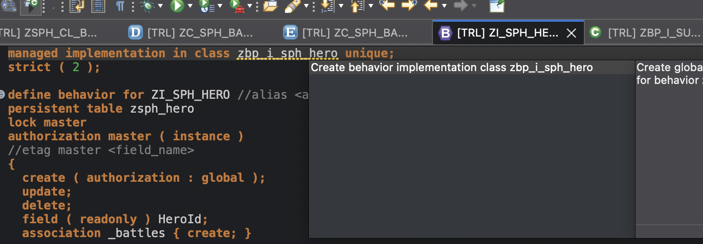

# Add edit functionality to the service

For adding edig functionality we need to create a behauviour definition for the service 

## adding behaviour 

- Right click the interface view for the hero entity
- choose new behaviour definition

- leave all settings as they are 
    - having the implementation type managed will automatically add CRUD operations to the service
- **Next**

- Choose you transport 
- **Finish**

- add persistent table for the battle entity
```
...
define behavior for ZI_SPH_BATTLE //alias <alias_name>
persistent table zsph_battle
lock dependent by _hero
...
```

- add mapping for the hero entity
```
  ...
  association _battles { create; }

  mapping for zsph_hero
    {
      Alignment = alignment;
      EyeColor  = eye_color;
      Gender    = gender;
      HairColor = hair_color;
      Height    = height;
      HeroId    = hero_id;
      Name      = name;
      Publisher = publisher;
      Race      = race;
      SkinColor = skin_color;
      Weight    = weight;
    }
    ...
```

- add mapping for the battle entity
```
...
   mapping for zsph_battle{
    BattleId = battle_id;
    DrawPercent = draw_percent;
    EnemyId = enemy_id;
    EnemyUniverseId = enemy_universe_id;
    HeroId = hero_id;
    HeroUniverseId = hero_universe_id;
    LosePercent = lose_percent;
    Url = url;
    WinPercent = win_percent;
  }
  ...
```
- adapt the readonly fields of the battle entity
```
...
  delete;
  field ( readonly ) BattleId, BattleName, HeroId;
  association _hero;
...
```

- at the top of the behaviour definition you will see a warning that the implementation class does not exists
- you can create this class using a quick fix (right click on the warning line -> choose quick fix or command + 1 )
- choose create behaviour definition

- leave the fields in the popup as they are 
- **Next**

- Choose you transport 
- **Finish**

- after activating everything
- go back to the preview
- you will notice that the edit and delete functionality are still not available
- this is because the consumption view also needs a behaviour definition

## consumption view behaviour
- In the consumption implementation you can choose what actions you will expose to your service
- right click the hero consumption view
- choose new behaviour definition 
- in the popup you will see the implemention type as projection 
- leave is as it is
- **Next**

- Choose you transport 
- **Finish**

- activate and check back in your preview, create and delete functions should be available 

## Add an action to your 
- open the behaviour implementation for your interface view
- add the action to the behaviour for the battles
    - ( features: )
```
...
  association  _hero ;
  action ( features : instance ) increaseWin result [1] $self;
...
```
- after activating you will see a warning on the behaviour definition
- via quick fix you can implement the method for the action

- use EML to implement the increase win method
    - EML (Emtity Modification Language) is used to READ and Modify Business objects. 
```
    READ ENTITIES OF zi_sph_hero IN LOCAL MODE
      ENTITY zi_sph_battle
        ALL FIELDS WITH CORRESPONDING #( keys )
      RESULT DATA(battles).

    LOOP AT battles ASSIGNING FIELD-SYMBOL(<battle>).
      IF <battle>-WinPercent < 100.
        <battle>-WinPercent = <battle>-WinPercent + 1.
        <battle>-LosePercent = <battle>-LosePercent - 1.
        MODIFY ENTITIES OF zi_sph_hero IN LOCAL MODE
        ENTITY zi_sph_battle
                 UPDATE
             FIELDS ( WinPercent LosePercent )
             WITH VALUE #( FOR key IN keys
                             ( %tky         = key-%tky
                               WinPercent = <battle>-WinPercent
                               LosePercent = <battle>-LosePercent ) )
        FAILED failed
        REPORTED reported.
      ENDIF.
    ENDLOOP.

    result = VALUE #( FOR battle IN battles
                        ( %tky   = battle-%tky
                          %param = battle ) ).
```
- add the action to your behaviour definition of the consumption view for the battle entity
```
define behavior for ZC_SPH_BATTLE 
{
  use update;
  use delete;

  use association _hero;
  use action increaseWin;
}
```
- In the metadata extension for battles add the for action annotation to the BattleName
```
  @UI: {  lineItem:       [
    { position: 10, label: 'Battle ID'},
    { position: 1, label: 'Battle ID', url: 'URL', type: #WITH_URL, qualifier: 'niceList' },
    { type: #FOR_ACTION, dataAction: 'increaseWin', label: 'increase win' }
  ],
  identification: [ { position: 10, label: 'Battle ID'}  ] }
  BattleName;

```
- go back to the preview you should now have the action available 