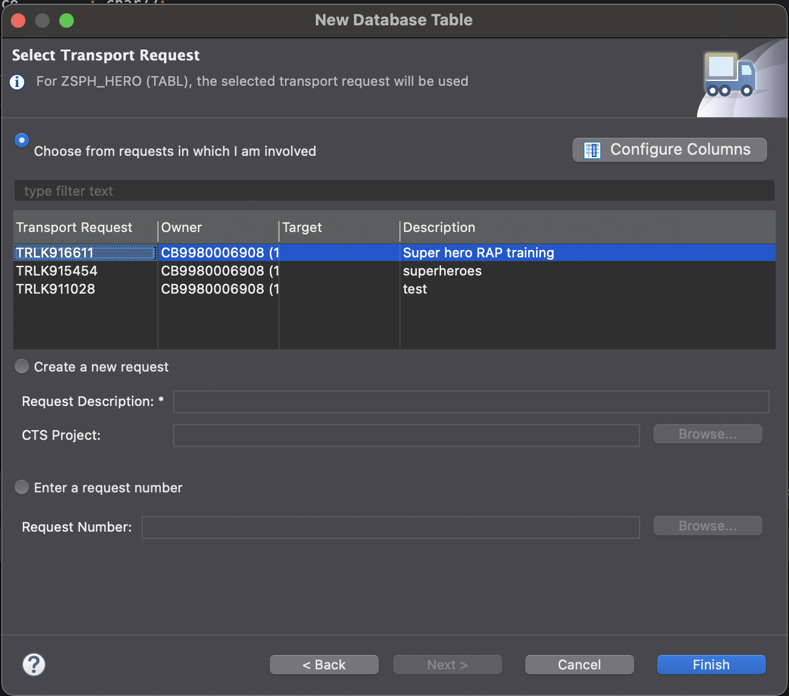

# Create a service definition 
 A service definition is created to choose what entities you want to expose in your service 
- Right click your hero consumption view 
- choose New Service definition


- enter name and description
- **Next**

- choose transport 
- **Next**

- **finish**

- expose the other entities and give aliases
```
@EndUserText.label: 'Heroes service definition'
define service ZSHP_SD_HERO
{
    expose ZC_SPH_HERO as hero;
    expose ZC_SPH_BATTLE as battle;
    expose ZC_SPH_UNIVERSE as universe;
}
```
